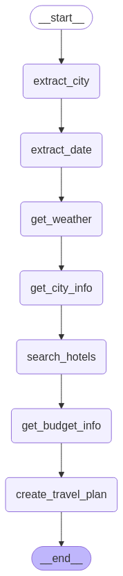

## System Architecture

The travel planner uses a workflow orchestrated by LangGraph, where each step is handled by a specialized agent powered by Llama 3.3, a large language model from Groq. Here's the workflow:

1. **City Extraction** → **Date Extraction** → **Weather Information** → **City Attractions** → **Hotel Search** → **Budget Info** → **Final Travel Plan**

## Key Components

### 1. State Management
The system maintains a `TravelState` that tracks:
- User messages
- Destination city
- Travel date
- Weather information
- Accommodation options
- Budget considerations
- Attractions and city information
- The final travel plan

### 2. Specialized Agents

Each agent handles a specific task:

- **City & Date Extraction Agents**: Parse the user's query to identify where and when they want to travel
- **Weather Agent**: Gets forecast data and suggests appropriate clothing
- **City Info Agent**: Collects information about attractions and historical places
- **Hotel Agent**: Searches for accommodations with ratings and amenities
- **Exchange Rate Agent**: Provides currency exchange information and budget advice
- **Travel Planner Agent**: Combines all information into a cohesive travel plan

### 3. External API Integration

The system connects to several external services:
- OpenWeather API for weather forecasts
- Wikipedia API for historical attractions
- Exchange Rate API for currency conversion
- Tavily Search API for hotel information

## How It Works: Example Walkthrough

When a user inputs: "I'm planning a trip to San Francisco this saturday. Can you help me plan my trip?"

1. **City Extraction**: The system identifies "San Francisco" as the destination
2. **Date Extraction**: It determines "this saturday" as the travel date and converts it to YYYY-MM-DD format
3. **Weather Information**: Gets the forecast for San Francisco on that date and suggests appropriate clothing
4. **City Information**: Collects information about top attractions in San Francisco
5. **Hotel Search**: Finds and rates accommodation options
6. **Budget Planning**: Gets exchange rates between Turkish Lira and USD, suggests budget breakdown
7. **Travel Plan Creation**: Combines all information into a comprehensive travel plan including:
   - Daily activities based on weather and attractions
   - Recommended hotel
   - Packing list
   - Budget considerations
   - Cultural insights

## Technical Implementation

This system demonstrates advanced techniques in AI orchestration:
- **LangGraph**: For workflow management and agent coordination
- **ReAct Pattern**: Allows agents to reason and take actions
- **Tool Use**: Enables the language model to interact with external APIs
- **State Management**: Maintains context throughout the planning process

